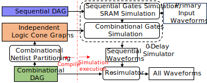
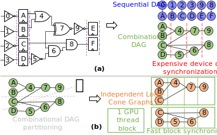

# GL0AM

## Introduction

GL0AM is a delay annotated, GPU accelerated gate-level logic simulator. It simulates in 4 value, and covers most simulation scenarios and SDF delay annotation involving single frequency clock stimuli and designs. At the end of simulation, a simple debug environment is also included. It operates by first performing a GPU accelerated 0-delay simulation on the design-under-test (DUT) from primary port inputs in order to acquire register/SRAM/clock gate output waveforms, and then does a GPU accelerated parallel re-simulation to acquire the remaining combinational gate waveforms. To minimize the issues of memory locality and synchronization overheads that often plague GPU accelerated logic simulation, we use a partitioning strategy to break top level netlists into smaller independent groups of logic cones that map to a single GPU thread block--thus using only the fastest block synchronization.

  

We used proprietary tools to compile verilog netlists, SDF delay files, and input waveforms to graph and array format, so for now, some of the simulation compilation process is still in progress of transitioning to fully open source. Updates to this should arrive in the future.

## Prerequisites, packages, installation, and dataset

GL0AM was developed using the following platform:

### 1. Hardware Platform
1. Developed on NVIDIA GV100 GPU and Intel Xeon Platinum 8174 CPU
2. Performance metrics gathered on NVIDIA H100 GPU and 80GB Intel Xeon Gold 6136 CPU

### 2. Software Platform
  * OS: Ubuntu 20.04.5
  * CUDA: nvcc-11.8
  * CUDA driver: 550.90.07
  * C/C++: gcc-9.4.0
  * Python: Python-3.8.10
    * PyTorch: 
   
### 3. Dataset
Input datasets are from open sources, and can be found at [this link](https://drive.google.com/drive/folders/1VIeTu6O_yIVv1qkEpi-qSUaYuhhC4ovK?usp=sharing) . Due to some of the compilation process still in progress of transitioning to fully open source, some precompiled graph data format is also included, for now.

## Trial Run

