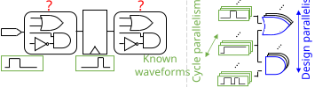
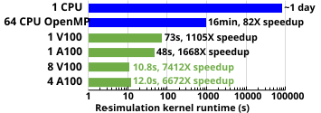

# GATSPI: GPU Accelerated GAte-level Simulation for Power Improvement

<div style="display: flex; justify-content: space-between;">
  
  
</div>

## Introduction

This is a branch of GL0AM that is serving the purpose of an open source version of one of GL0AM's predecessors and dependencies, [GATSPI: GPU Accelerated GAte-level Simulation for Power Improvement](https://dl.acm.org/doi/10.1145/3489517.3530601). GATSPI is a GPU accelerated re-simulator. That is to say, it takes a gate-level netlist and primary+pseudo-primary (sequential component outputs such as register, clock gate, and SRAM outputs) waveforms as input, and produces delay annotated combinational logic waveforms as outputs. More information can be found in our [publication](https://dl.acm.org/doi/10.1145/3489517.3530601). The repository includes [benchmark data](https://drive.google.com/drive/folders/1khAfeWOfm6yyPPvbvqPNNVMvKzNFj32a?usp=sharing) and a corresponding regression suite (see below) for getting started.

## Prerequisites, packages, installation

We used a [Dockerfile](Dockerfile) to build a docker for the environment to run this simulator. But, for the most part, the following is needed:

### 1. Hardware Platform
  * Developed on NVIDIA GV100 GPU and Intel Xeon Platinum 8174 CPU. (But, most any GPUs should work)

### 2. Software Platform
  * OS: Ubuntu 20.04.5
  * CUDA: nvcc-11.8
  * CUDA driver: 550.90.07 or similar
  * Rust: 1.85.1 (though 1.82 and/or above should work)
  * Python: Python-3.8.10, with the following packages:
    * PyTorch: 2.4.0+cu118
    * DGL: 2.4.0+cu118
    * CuPy: 11.0.0 or similar
  
Licenses for the 3rd party software can be found in [LICENSES.txt](LICENSES.txt).

## Regression Suite
1. Download the benchmark data from here.
2. Run and follow the [regression.sh](https://github.com/NVlabs/GL0AM/blob/GATSPI/regression.sh) script.

## Citation
Though the 2nd part of GL0AM is essentially GATSPI, this branch reflects the original 2022 DAC publication version that implements 2-value re-simulation. As such, based on what is used, feel free to use the following citation:
```
@article{paszke2017automatic,
  title={Automatic differentiation in PyTorch},
  author={Paszke, Adam and Gross, Sam and Chintala, Soumith and Chanan, Gregory and Yang, Edward and DeVito, Zachary and Lin, Zeming and Desmaison, Alban and Antiga, Luca and Lerer, Adam},
  year={2017}
}
@inproceedings{10.1145/3489517.3530601,
author = {Zhang, Yanqing and Ren, Haoxing and Sridharan, Akshay and Khailany, Brucek},
title = {GATSPI: GPU accelerated gate-level simulation for power improvement},
year = {2022},
publisher = {Association for Computing Machinery},
series = {DAC '22}
}
```
